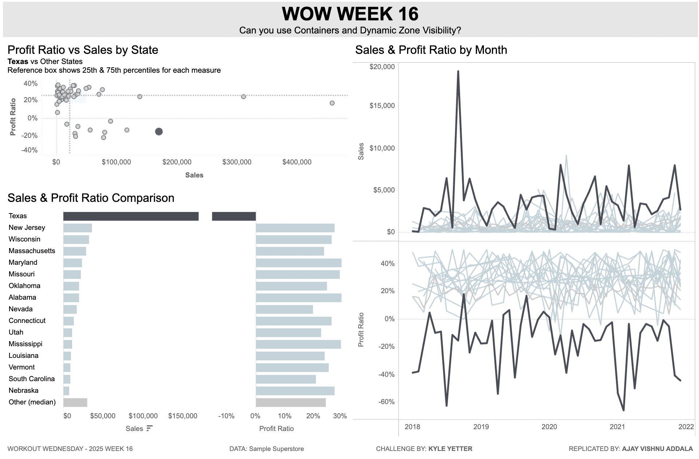

# Workout Wednesday 2025: Week 16 – Containers and Dynamic Zone Visibility in Tableau

## Introduction
This project is part of the #WorkoutWednesday Tableau Challenge for Week 16 of 2025. The focus of the challenge is to create a dashboard layout using **containers** and **dynamic zone visibility** while implementing various interactive actions. The dashboard was built using Tableau Public, with the provided starter workbook as a foundation.

## Requirements
The dashboard meets the following specifications:
- **Size**: 1200×900.
- **Layout**: Built entirely using containers (no floating elements).
- **Bar Chart**: Created a `Sales/Profit Ratio by Subcategory` chart.
- **Dynamic Visibility**: Displayed the bar chart, title, and legend dynamically when:
  - A `State` is selected from the "Sales & PR Comparison" chart.
  - A `Month` is selected from the "Sales & PR by Month" chart.
- **Dynamic Title**: Updated the title dynamically to reflect the selected `State` and/or `Month`.
- **Color Legend**: Included a color legend for the bar chart.
- **Scatterplot Interaction**:
  - Set the `Scatterplot State` parameter when a scatterplot point is clicked.
  - Removed persistent highlighting upon deselection (no grayed-out elements).
- **Comparison Bar Interaction**:
  - Set the `State Name Set` parameter when a bar is clicked (single-click only).
  - Highlighted the corresponding state in the line chart.

## Dashboard Preview

## Tableau Public Link
[View the Dashboard on Tableau Public]([https://public.tableau.com/app/workbook_link](https://public.tableau.com/views/ContainersDynamicZoneVisibilityWOW2025W16/WOW2025W16?:language=en-US&:sid=&:redirect=auth&:display_count=n&:origin=viz_share_link))

## How to Use
1. Open the dashboard in Tableau Public using the link above.
2. Interact with the following elements:
   - **Scatterplot**: Click to set the `Scatterplot State` and observe how the interaction updates other components.
   - **Comparison Bar Chart**: Select a state to update the `State Name Set` and highlight it in the line chart.
   - **Filters**: Select a state or month to dynamically display the `Sales/Profit Ratio by Subcategory` bar chart.
3. Observe the dynamic title updating based on selected filters.

## Key Tableau Features Used
- **Containers**: Structured the dashboard layout without any floating elements.
- **Dynamic Zone Visibility**: Controlled visibility of the bar chart and related components.
- **Actions**:
  - **Parameter Actions**: Updated parameters like `Scatterplot State` and `State Name Set` through clicks.
  - **Highlight Actions**: Used for the line chart state highlighting.
  - **Filter Actions**: Dynamically filtered views based on user interaction.
- **Dynamic Titles**: Adjusted titles to display relevant selections (state and/or month).

## File Structure
